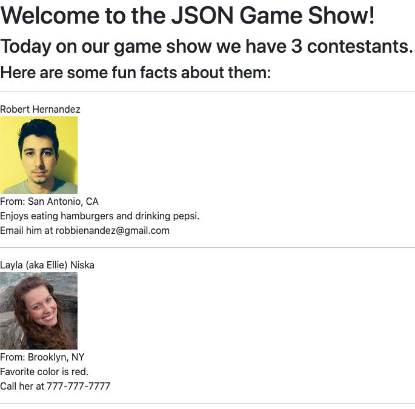

# Objects Coding Challenge

## Task 0: Before you begin

Here is what you are starting with:


As you can see, there's not much there yet!

But before you move on to Task 1, observe the starter code and study how it produces the current output.

## Task 1: Finish contestants A and B

Let's see if we can turn it into this:


For this task, you should _only_ be modifying the `people` variable and uncommenting any `document.write()` that you want to test. 

For example, notice this line of code:

```js
// document.write("From: " + conA.location.city + ", " + conA.location.state); // From: Brooklyn, NY
```

It's commented out because `conA.location.city` and `conA.location.state` don't exist yet.

Go ahead and modify `people` so that those two properties are defined with `Brooklyn` and `NY`, as noted by the comment.

When you're ready, uncomment the `document.write()` to see it in action!

Repeat this process until your code produces a result matching the screenshot above.

## Task 2: Make sure the properties are thorough

Notice how we have these two lines of code:

```js
var conA = people[0];
var conB = people[1];
```

This allows us to quickly and easily change the contestants around, but keep which fun facts we want to display. Go ahead and swap the `1` and `0` so that it looks like this:

```js
var conA = people[1];
var conB = people[0];
```

_Ideally_, your preview would now look something like this:



But it probably doesn't. Why not? Because as we construct our data, we want to make sure it's thorough. For example, if **Robert** has a nickname, we need to make sure **Layla** has one too, just in case it gets used. Essentially, our properties should (generally) be consistent from object to object.

Go ahead and update your `people` variable so that you have consistent properties for each contestant and the preview matches the screenshot above. Do **NOT** change any of the `document.write()`s. NOTE: the comments for those will no longer match the right contestants, but don't worry about that.

## Task 3: Make a third contestant!

You heard me. You'll have to add:
* to your `people` array
* some `document.write()`s at the bottom

For the image, choose any number up to `99` from the `men` or `women`.

Have fun with this one. Feel free to make up random "facts"!